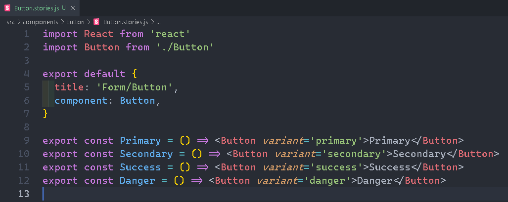
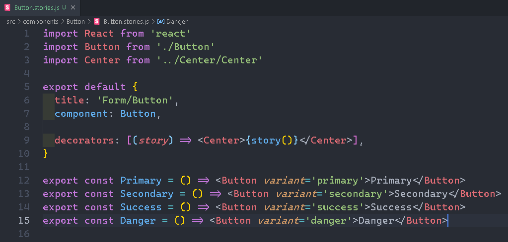
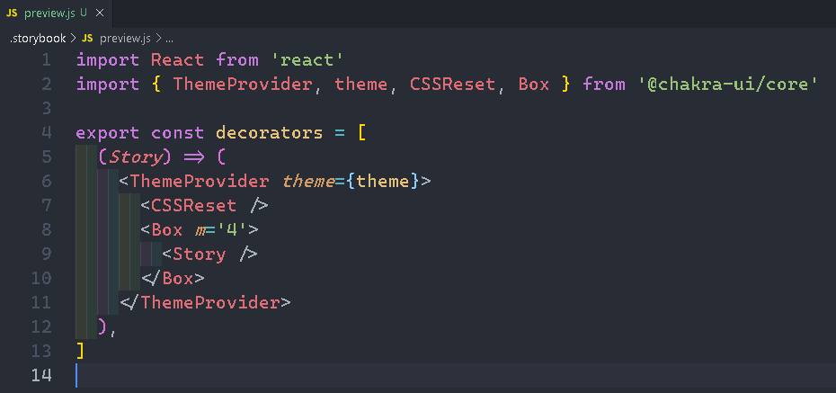

# Storybook

A development environment and playground for UI components.

Create components independently.

Showcase those components interactively in an isolated development environment.

Ability to view the different components that have been already developed.

View what are the different props that those developed components accept.

Ability to visually showcase those components to your stake holders for feedback.

Dynamically change props on a components and immediately see the change in the UI without moving back and forth to the browser and editor.

Feedback of the accessibility score of the components like color contrast.

## CMD commmands

npx sb init

yarn storybook

### Writing Stories

Create a folder name components in ./src

Create a folder Button in ./src/components

Create following files in ./src/components/Button
Button.css
Button.js
Button.stories.

<!-- ./src/components/Button/Button.js -->

<!-- ./src/components/Button/Button.css -->

<!-- ./src/components/Button/Button.stories.js -->

### Another story (Input)

Create a folder Input in ./src/components

Create following files in ./src/components/Input

Input.css

Input.js

Input.stories.js

<!-- ./src/components/Input/Input.js -->

<!-- ./src/components/Input/Input.css -->

<!-- ./src/components/Input/Input.stories.js -->

### Story Hierarchy

Grouping components under a label (Form)

<!-- ./src/components/Button/Button.stories.js -->

<!-- ./src/components/Input/Input.stories.js -->

### Rename stories

Renaming the Small to Small Input

<!-- ./src/components/Input/Input.stories.js -->

### Sorting stories

<!-- ./.storybook/preview.js -->

### Story within a story

Create a folder Subscription under ./src

Create a new file Subscription.stories.js

<!-- ./src/Subscription/Subscription.stories.js -->

Advantages of writing story within story

1. First we reduce the amount of code we write.

2. If we made changes in the other story, it will automatically get reflected in this story.

### Using args

In v6 each story is considered to be a component with set of arguments. For eg :- props are considered as arguments.

Args mechanism start with having to create template.

<!-- ./src/components/Button/Button.stories.js -->

Button.stories.js

Can define args as default export, so that all components have same children props.

Args at story level will overwrite the args at component level

### Decorators

Create a folder Center under ./src/components

Create following files in ./src/components/Center

Center.js

Center.css

<!-- ./src/components/Center/Center.js-->

<!-- ./src/components/Center/Center.css-->

<!-- ./src/components/Button/Button.stories.js -->

Button.stories.js

Local Decorators

<!-- ./.storybook/preview.js -->

<!-- ./src/components/Button/Button.stories.js -->

### Theming

<!-- CMD Command (Install package) -->

yarn add @chakra-ui/core @emotion/core

Create a folder ChakraButton under ./src/components

Create a file ChakraButton.stories.js under ./src/components/ChakraButton

<!-- ./src/components/ChakraButton/ChakraButton.stories.js -->

<!-- ./.storybook/preview.js -->

### Theming and Decorators in v6

<!-- ./.storybook/preview.js -->

### Addons in v6

Addons as the name implicate add extra features to the storybook.

In v6, there are some essential addons which storybook install when we run the init command.

Light and Dark Background

Light Background :-

Dark Background :-

Clear Background :-

<!-- ./src/components/ChakraButton/ChakraButton.stories.js -->

Green control can be change to any other color

Children can also be changed

Can add actions (like onclick)

Docs Addon

Can check code.

Grid Addon

Viewport Addon

Small Mobile

Large Mobile

Tablet

Enable Measure Addon

Outlines Addon

### Custom Addons

onClick action addon

Actions addon

